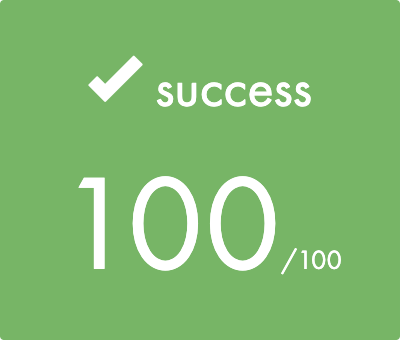

# Push_Swap-42Quebec

## Subject

<a href="https://github.com/yanislabbe/Push_Swap-42Quebec/blob/main/requirement/Push_Swap-Subject-FR-42Quebec.pdf">Subject</a>

## Usage

``make`` to compile.

## Results

	

